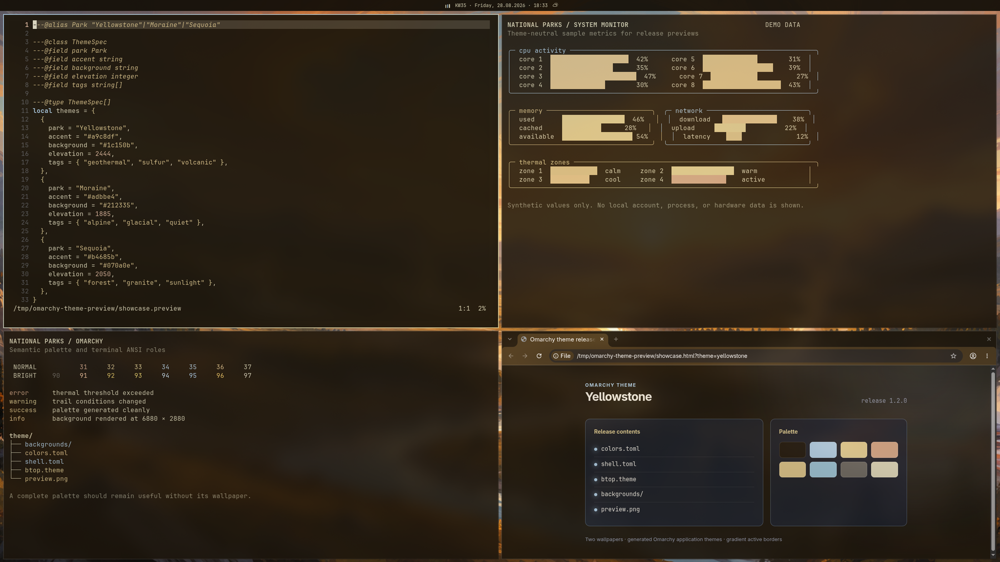
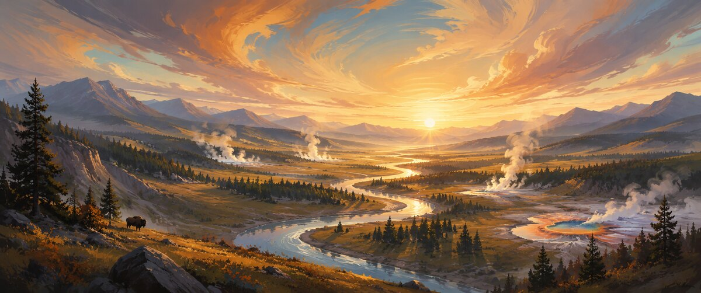
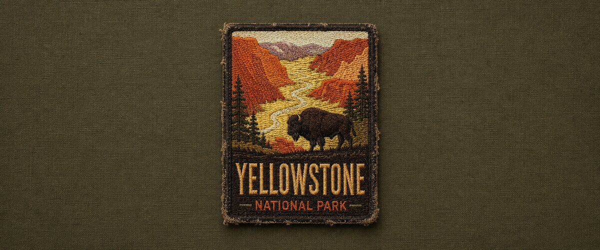

# Yellowstone for Omarchy

A dark Omarchy theme built around Aether's current Yellowstone palette: volcanic black, ember orange, sulfur gold, and warm parchment. Aether generated the palette from the illustrated wallpaper. The illustrated wallpaper is the default; the embroidered patch is the alternate.



## Wallpapers

### Illustrated (default)



### Embroidered patch alternate



## Install

```bash
omarchy theme install https://github.com/nibra180/omarchy-yellowstone-theme
```

Reapply it later with:

```bash
omarchy theme set yellowstone
```

## Included

- `colors.toml` defines complete Omarchy semantic and ANSI color roles.
- `shell.toml` uses ember-orange-to-sulfur borders over volcanic black surfaces.
- `btop.theme`, `chromium.theme`, and `icons.theme` cover app-specific details.
- `backgrounds/` contains two 6880×2880 wallpapers; the illustrated version is the default.
- `preview.png` is the 1800×1012 gallery preview.
- `DESIGN.md` records the palette and visual rules.

Omarchy generates Hyprland, terminal, Neovim, Helix, Pi, Obsidian, keyboard, and VS Code files from `colors.toml`. The repository contains no custom Lua or terminal configuration, so Git-installed copies retain the intended design.

## Artwork and affiliation

The wallpapers and preview were created by nibra180. The theme is inspired by Yellowstone National Park and is not affiliated with or endorsed by the National Park Service. See [ASSETS.md](ASSETS.md) for attribution details.

## License

Theme configuration and documentation are licensed under the [MIT License](LICENSE). The wallpapers and preview are licensed under [CC BY 4.0](LICENSES/CC-BY-4.0.txt).
